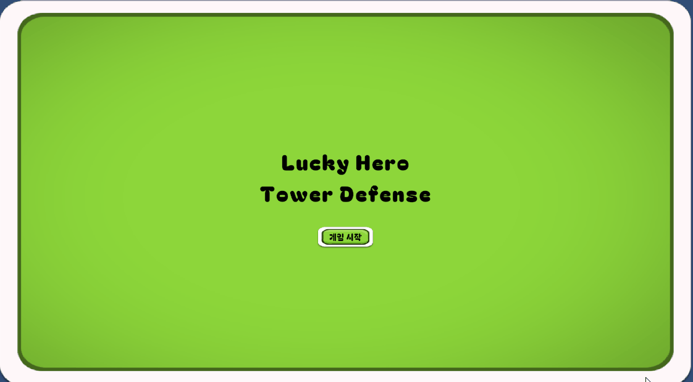

# Lucky Hero Tower Defense

## 프로젝트 소개
Unity로 제작한 타워 디펜스 토이 프로젝트입니다.

## 주요 기능
- Tilemap 기반으로 몬스터 경로 및 유닛 배치 구역 설계
- 웨이브 단위로 몬스터 스폰 및 관리
- 영웅(유닛) 배치와 공격 시스템 구현
- 골드 획득 및 자원 관리
- 게임 진행 상황에 따른 UI 표시
- 게임시작 → 플레이 → 게임오버 → 재시작 흐름 제어
- 몬스터 및 영웅 애니메이션 제어

## 사용 기술
- Unity
- C#

## 스크린샷 / GIF
### 시작화면

### 게임플레이

### 유닛배치

### 보스등장

### 게임오버

### 게임 플레이 GIF

## 개발 과정 및 배운 점
- 게임 매니저, 스폰 매니저 등 핵심 시스템에 싱글톤 패턴 적용
- Tilemap을 활용한 맵 및 몬스터 경로 구성
- 게임시작 → 플레이 → 게임오버 → 재시작 흐름 구현으로 게임 상태 관리 경험
- 오브젝트 풀링 적용으로 오브젝트 관리 효율화 및 성능 최적화 경험
- 유니티 애니메이션 적용으로 캐릭터 움직임과 표현 관리
- ReactiveProperty와 이벤트 기반 설계를 통해 상태 변화를 감지하고 데이터 바인딩을
구현함으로써 게임 로직과 UI간의 효율적인 연동 경험
- 코드 구조화와 리팩토링을 통해 유지보수성과 확장성 향상
